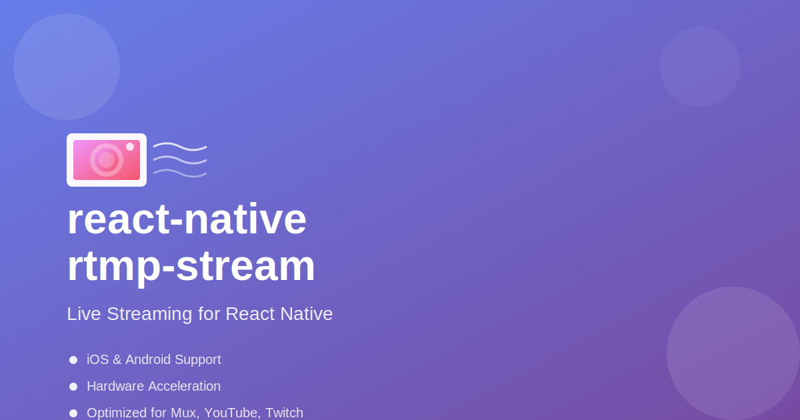
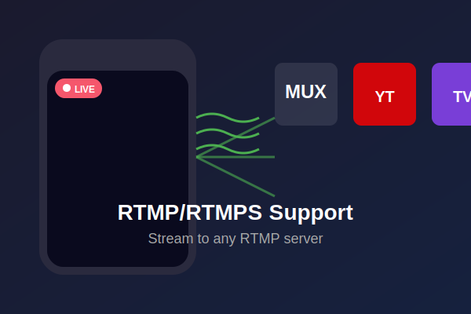
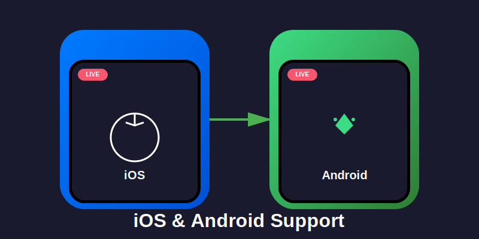
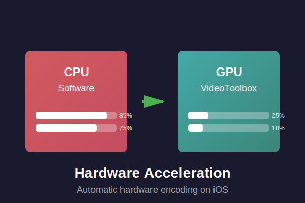
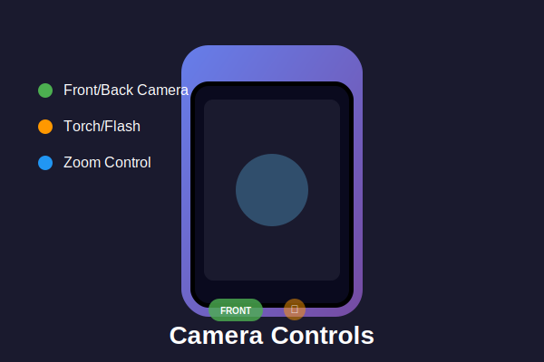
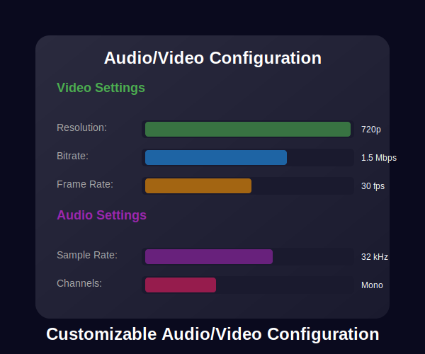
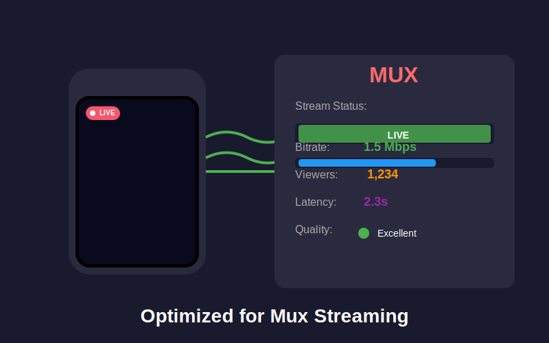
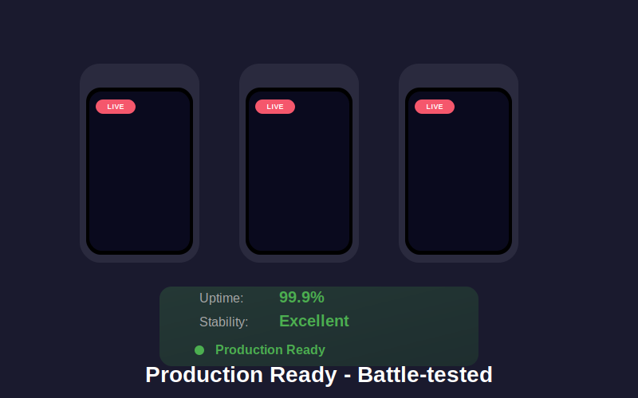

# react-native-rtmp-stream



[](https://www.npmjs.com/package/react-native-rtmp-stream)
[](https://www.npmjs.com/package/react-native-rtmp-stream)

A production-ready React Native library for RTMP/RTMPS live streaming with comprehensive iOS and Android support. Optimized for Mux, YouTube Live, Twitch, and other major streaming platforms.

## Features

### Full RTMP/RTMPS Support



Stream to any RTMP server with full compatibility for Mux, YouTube Live, Twitch, and custom RTMP servers.

### iOS & Android Support



Native implementation for both platforms with a unified API. Write once, deploy everywhere.

### Hardware Acceleration



Automatic hardware encoding on iOS using VideoToolbox. Optimized performance with minimal CPU usage.

### Portrait & Landscape Orientation



Full orientation support with seamless rotation and orientation handling.

### Camera Controls



Complete camera control including front/back camera switching, torch, and zoom functionality.

### Audio/Video Configuration



Comprehensive configuration options for bitrate, resolution, frame rate, and codec settings.

### Mux Optimized



Tested and optimized for Mux streaming with production-ready integration.

### Production Ready



Battle-tested in production environments with proven reliability and stability.

## Installation

```bash
npm install react-native-rtmp-stream
```

### iOS Setup

```bash
cd ios && pod install && cd ..
```

### Android Setup

No additional setup required. The library automatically links.

## Permissions

### iOS

Add to `ios/YourApp/Info.plist`:

```xml
<key>NSCameraUsageDescription</key>
<string>This app needs access to your camera for live streaming.</string>
<key>NSMicrophoneUsageDescription</key>
<string>This app needs access to your microphone for live streaming.</string>
```

### Android

Add to `android/app/src/main/AndroidManifest.xml`:

```xml
<uses-feature android:name="android.hardware.camera"/>
<uses-feature android:name="android.hardware.camera.autofocus"/>
<uses-permission android:name="android.permission.CAMERA"/>
<uses-permission android:name="android.permission.RECORD_AUDIO"/>
<uses-permission android:name="android.permission.FLASHLIGHT"/>
```

## Quick Start

### Simple Example

```javascript
/**
 * LiveStreamView Component
 * 
 * A self-contained, reusable component for RTMP/RTMPS live streaming.
 * Handles all streaming logic, permissions, and lifecycle management.
 */

import React, { useRef, useEffect, useState, forwardRef, useImperativeHandle } from 'react';
import { Platform, StyleSheet, Alert, Linking } from 'react-native';
import { PERMISSIONS, request, check, RESULTS } from 'react-native-permissions';
import { RTMPStreamPublisher } from '../../../custom_node_modules/react-native-rtmp-stream';

/**
 * LiveStreamView Component
 * 
 * @param {string} streamURL - Full RTMP/RTMPS stream URL (e.g., "rtmps://global-live.mux.com:443/app/STREAM_KEY")
 * @param {boolean} autoStart - Automatically start preview when ready (default: true)
 * @param {boolean} debug - Enable automatic event logging (default: false)
 * @param {boolean} frontCamera - Use front camera (default: false)
 * @param {function} onStreamStart - Callback invoked when stream starts successfully
 * @param {function} onStreamStop - Callback invoked when stream stops
 * @param {function} onStreamError - Callback invoked when stream error occurs (code, message)
 * @param {function} onPreviewReady - Callback invoked when camera preview is ready
 * @param {object} style - Custom styles for the component
 * @param {object} audioParam - Custom audio parameters (optional)
 * @param {object} videoParam - Custom video parameters (optional)
 */
const LiveStreamView = forwardRef(({
  streamURL,
  autoStart = true,
  debug = false,
  frontCamera = false,
  onStreamStart,
  onStreamStop,
  onStreamError,
  onPreviewReady,
  style,
  audioParam,
  videoParam,
}, ref) => {
  const publisherRef = useRef(null);
  const [permissionsGranted, setPermissionsGranted] = useState(false);
  const [isStreaming, setIsStreaming] = useState(false);
  const [isPreviewReady, setIsPreviewReady] = useState(false);
  const previewReadyRef = useRef(false);

  // Default configuration
  const getDefaultConfig = () => {
    const isIOS = Platform.OS === 'ios';
    return {
      audioParam: audioParam || {
        codecid: RTMPStreamPublisher.CODEC_ID_AAC,
        profile: RTMPStreamPublisher.PROFILE_AAC_LC,
        samplerate: 32000,
        channels: 1,
        bitrate: 32000,
      },
      videoParam: videoParam || {
        codecid: RTMPStreamPublisher.CODEC_ID_H264,
        profile: RTMPStreamPublisher.PROFILE_H264_MAIN,
        width: 720,
        height: 1280,
        fps: 30,
        bitrate: 1500000,
      },
    };
  };

  const config = getDefaultConfig();

  // Expose methods via ref
  useImperativeHandle(ref, () => ({
    start: () => {
      if (publisherRef.current) {
        // Android doesn't need preview ready check, iOS does
        if (Platform.OS === 'android' || isPreviewReady) {
          publisherRef.current.start();
        } else {
          console.warn('⚠️ Cannot start stream: Preview not ready');
          if (onStreamError) {
            onStreamError(2003, 'Preview not ready');
          }
        }
      }
    },
    stop: () => {
      if (publisherRef.current) {
        publisherRef.current.stop();
      }
    },
    startPreview: () => {
      if (publisherRef.current) {
        publisherRef.current.startPreview();
      }
    },
    stopPreview: () => {
      if (publisherRef.current) {
        publisherRef.current.stopPreview();
      }
    },
    isStreaming: () => isStreaming,
    isPreviewReady: () => isPreviewReady,
  }));

  // Request permissions for both platforms
  useEffect(() => {
    const requestPermissions = async () => {
      try {
        let cameraPermission, micPermission;

        if (Platform.OS === 'android') {
          // Android: Check permissions first, then request if needed
          cameraPermission = await check(PERMISSIONS.ANDROID.CAMERA);
          micPermission = await check(PERMISSIONS.ANDROID.RECORD_AUDIO);

          // Request if not granted
          if (cameraPermission !== RESULTS.GRANTED) {
            cameraPermission = await request(PERMISSIONS.ANDROID.CAMERA);
          }
          if (micPermission !== RESULTS.GRANTED) {
            micPermission = await request(PERMISSIONS.ANDROID.RECORD_AUDIO);
          }
        } else {
          // iOS: Check permissions first, then request if needed
          cameraPermission = await check(PERMISSIONS.IOS.CAMERA);
          micPermission = await check(PERMISSIONS.IOS.MICROPHONE);

          // Request if not granted
          if (cameraPermission !== RESULTS.GRANTED) {
            cameraPermission = await request(PERMISSIONS.IOS.CAMERA);
          }
          if (micPermission !== RESULTS.GRANTED) {
            micPermission = await request(PERMISSIONS.IOS.MICROPHONE);
          }
        }

        // Check final permission status
        if (cameraPermission === RESULTS.GRANTED && micPermission === RESULTS.GRANTED) {
          setPermissionsGranted(true);
        } else {
          // Handle blocked permissions
          if (cameraPermission === RESULTS.BLOCKED || micPermission === RESULTS.BLOCKED) {
            Alert.alert(
              'Permissions Required',
              'Camera and microphone permissions are required for live streaming. Please enable them in Settings.',
              [
                { text: 'Cancel', style: 'cancel' },
                { 
                  text: 'Open Settings', 
                  onPress: () => {
                    Linking.openSettings();
                  }
                }
              ]
            );
          } else {
            Alert.alert(
              'Permissions Required',
              'Camera and microphone permissions are required for live streaming.'
            );
          }
        }
      } catch (error) {
        console.error('Error requesting permissions:', error);
        Alert.alert('Error', 'Failed to request permissions. Please try again.');
      }
    };

    requestPermissions();
  }, []);

  // Start preview after permissions are granted - platform-specific timing
  useEffect(() => {
    if (!autoStart || !publisherRef.current || !permissionsGranted) return;
    
    // Both platforms start preview after permissions are granted
    // Android: Faster timing (100ms), iOS: Slower timing (1000ms) for view layout
    const delay = Platform.OS === 'android' ? 100 : 1000;
    const timer = setTimeout(() => {
      if (publisherRef.current) {
        publisherRef.current.startPreview();
      }
    }, delay);
    
    return () => clearTimeout(timer);
  }, [autoStart, permissionsGranted]);

  // Handle stream events
  const handleEvent = (code, msg) => {
    switch (code) {
      case 2001: // Preview ready
        previewReadyRef.current = true;
        setIsPreviewReady(true);
        if (onPreviewReady) {
          onPreviewReady();
        }
        break;

      case 2004: // Connection started
        // Stream is connecting
        break;

      case 2005: // Stream connected
        if (msg && msg.includes('write packet') && msg.includes('error')) {
          // Write error
          setIsStreaming(false);
          if (onStreamError) {
            onStreamError(code, msg);
          }
          if (Platform.OS === 'ios') {
            Alert.alert(
              'Streaming Error',
              'Failed to send video data. Please ensure camera preview is visible before starting stream.'
            );
          }
        } else {
          // Success
          setIsStreaming(true);
          if (onStreamStart) {
            onStreamStart();
          }
        }
        break;

      case 2002: // Stopped
      case 2007: // Disconnected
        setIsStreaming(false);
        previewReadyRef.current = false;
        setIsPreviewReady(false);
        if (onStreamStop) {
          onStreamStop();
        }
        break;

      case 2003: // Error
      case 2006: // Network timeout
        setIsStreaming(false);
        if (onStreamError) {
          onStreamError(code, msg);
        }
        if (Platform.OS === 'ios' && code === 2003) {
          Alert.alert(
            'Streaming Error',
            `Streaming error: ${msg || 'Unknown error'}\n\nPlease check your network connection and stream key.`,
            [
              { text: 'OK' },
              {
                text: 'Retry',
                onPress: () => {
                  setTimeout(() => {
                    if (publisherRef.current && isPreviewReady) {
                      publisherRef.current.start();
                    }
                  }, 1000);
                },
              },
            ]
          );
        }
        break;

      default:
        break;
    }
  };

  // Cleanup on unmount
  useEffect(() => {
    return () => {
      if (publisherRef.current) {
        try {
          publisherRef.current.stop();
          publisherRef.current.stopPreview();
        } catch (error) {
          // Ignore cleanup errors
        }
      }
    };
  }, []);

  if (!streamURL) {
    console.warn('⚠️ LiveStreamView: streamURL is required');
    return null;
  }

  return (
    <RTMPStreamPublisher
      ref={publisherRef}
      style={[StyleSheet.absoluteFill, style]}
      url={streamURL}
      debug={debug}
      audioParam={config.audioParam}
      videoParam={config.videoParam}
      frontCamera={frontCamera}
      videoOrientation={RTMPStreamPublisher.VIDEO_ORIENTATION_PORTRAIT}
      HWAccelEnable={Platform.OS === 'ios'} // iOS uses VideoToolbox, Android uses MediaCodec
      keyFrameInterval={30}
      onEvent={handleEvent}
    />
  );
});

LiveStreamView.displayName = 'LiveStreamView';

export default LiveStreamView;
```

### Complete Example with Controls

See the [SimpleLiveStream example](./examples/SimpleLiveStream.js) for a complete implementation including:
- Permission handling
- Start/Stop controls
- Status indicators
- Error handling
- Debug mode

## API Reference

### RTMPStreamPublisher

Main component for live streaming.

#### Props

| Prop | Type | Default | Description |
|------|------|---------|-------------|
| `url` | `string` | **Required** | RTMP/RTMPS stream URL |
| `audioParam` | `object` | **Required** | Audio encoding parameters |
| `videoParam` | `object` | **Required** | Video encoding parameters |
| `frontCamera` | `boolean` | `false` | Use front camera |
| `videoOrientation` | `number` | `1` | Video orientation (see constants) |
| `HWAccelEnable` | `boolean` | `true` (iOS) | Enable hardware acceleration |
| `keyFrameInterval` | `number` | `30` | Keyframe interval (frames) |
| `denoiseEnable` | `boolean` | `false` | Enable audio denoising |
| `torchEnable` | `boolean` | `false` | Enable camera torch |
| `enhancedRtmp` | `boolean` | `false` | Use enhanced RTMP protocol |
| `cameraDevice` | `number` | `0` | Camera device type (see constants) |
| `roomRatio` | `number` | `0` | Room echo cancellation ratio |
| `volume` | `number` | `1.0` | Audio volume (0.0 - 1.0) |
| `cryptoKey` | `string` | - | Encryption key for secure streams |
| `debug` | `boolean` | `false` | Enable automatic event logging to console |
| `onEvent` | `function` | - | Event callback `(code, msg) => {}` |

#### Methods

- `start()` - Start streaming
- `stop()` - Stop streaming
- `startPreview()` - Start camera preview
- `stopPreview()` - Stop camera preview

#### Event Codes

| Code | Description |
|------|-------------|
| `2000` | Connecting to server |
| `2001` | Preview started / Ready to stream |
| `2003` | Error occurred |
| `2004` | Connection started |
| `2005` | Stream connected successfully |
| `2006` | Network timeout |
| `2007` | Stream disconnected |

### Audio Parameters

```javascript
audioParam: {
  codecid: RTMPStreamPublisher.CODEC_ID_AAC,  // Audio codec
  profile: RTMPStreamPublisher.PROFILE_AAC_LC, // AAC profile
  samplerate: 32000,  // Sample rate: 8000, 16000, 32000, 44100, 48000
  channels: 1,        // Channels: 1 (mono) or 2 (stereo)
  bitrate: 32000,     // Audio bitrate (bits per second)
}
```

### Video Parameters

```javascript
videoParam: {
  codecid: RTMPStreamPublisher.CODEC_ID_H264,  // Video codec
  profile: RTMPStreamPublisher.PROFILE_H264_MAIN, // H.264 profile
  width: 720,   // Video width (pixels)
  height: 1280, // Video height (pixels)
  fps: 30,      // Frame rate (frames per second)
  bitrate: 1500000, // Video bitrate (bits per second)
}
```

## Recommended Settings

### iOS - Portrait (9:16)

```javascript
audioParam: {
  codecid: RTMPStreamPublisher.CODEC_ID_AAC,
  profile: RTMPStreamPublisher.PROFILE_AAC_LC,
  samplerate: 32000,
  channels: 1,
  bitrate: 32000,
},
videoParam: {
  codecid: RTMPStreamPublisher.CODEC_ID_H264,
  profile: RTMPStreamPublisher.PROFILE_H264_MAIN,
  width: 720,
  height: 1280,
  fps: 30,
  bitrate: 1500000,
},
HWAccelEnable: true, // Always enabled on iOS
videoOrientation: RTMPStreamPublisher.VIDEO_ORIENTATION_PORTRAIT,
```

### iOS - Landscape (16:9)

```javascript
videoParam: {
  codecid: RTMPStreamPublisher.CODEC_ID_H264,
  profile: RTMPStreamPublisher.PROFILE_H264_MAIN,
  width: 1280,
  height: 720,
  fps: 30,
  bitrate: 2000000,
},
videoOrientation: RTMPStreamPublisher.VIDEO_ORIENTATION_LANDSCAPE_RIGHT,
```

### Android - Portrait (9:16)

```javascript
audioParam: {
  codecid: RTMPStreamPublisher.CODEC_ID_AAC,
  profile: RTMPStreamPublisher.PROFILE_AAC_LC,
  samplerate: 44100,
  channels: 2,
  bitrate: 64000,
},
videoParam: {
  codecid: RTMPStreamPublisher.CODEC_ID_H264,
  profile: RTMPStreamPublisher.PROFILE_H264_BASELINE,
  width: 720,
  height: 1280,
  fps: 30,
  bitrate: 2000000,
},
```

### Android - Landscape (16:9)

```javascript
videoParam: {
  codecid: RTMPStreamPublisher.CODEC_ID_H264,
  profile: RTMPStreamPublisher.PROFILE_H264_BASELINE,
  width: 1280,
  height: 720,
  fps: 30,
  bitrate: 2500000,
},
```

## Constants

### Codec IDs

```javascript
RTMPStreamPublisher.CODEC_ID_H264 = 27
RTMPStreamPublisher.CODEC_ID_H265 = 173
RTMPStreamPublisher.CODEC_ID_AAC = 86018
```

### H.264 Profiles

```javascript
RTMPStreamPublisher.PROFILE_AUTO = 0
RTMPStreamPublisher.PROFILE_H264_BASELINE = 66
RTMPStreamPublisher.PROFILE_H264_MAIN = 77
RTMPStreamPublisher.PROFILE_H264_HIGH = 100
```

### AAC Profiles

```javascript
RTMPStreamPublisher.PROFILE_AAC_LC = 1
RTMPStreamPublisher.PROFILE_AAC_HE = 4
RTMPStreamPublisher.PROFILE_AAC_HE_V2 = 28
RTMPStreamPublisher.PROFILE_AAC_LD = 22
RTMPStreamPublisher.PROFILE_AAC_ELD = 38
```

### Video Orientation

```javascript
RTMPStreamPublisher.VIDEO_ORIENTATION_PORTRAIT = 1
RTMPStreamPublisher.VIDEO_ORIENTATION_LANDSCAPE_RIGHT = 3
RTMPStreamPublisher.VIDEO_ORIENTATION_LANDSCAPE_LEFT = 4
```

### Camera Device Types

```javascript
RTMPStreamPublisher.DEVICE_TYPE_WideAngleCamera = 0
RTMPStreamPublisher.DEVICE_TYPE_TelephotoCamera = 1
RTMPStreamPublisher.DEVICE_TYPE_UltraWideCamera = 2
RTMPStreamPublisher.DEVICE_TYPE_DualCamera = 3
RTMPStreamPublisher.DEVICE_TYPE_TripleCamera = 4
```

## Streaming to Mux

```javascript
const muxStreamKey = 'YOUR_MUX_STREAM_KEY';
const streamURL = `rtmps://global-live.mux.com:443/app/${muxStreamKey}`;

<RTMPStreamPublisher
  url={streamURL}
  // ... other props
/>
```

## Streaming to YouTube Live

```javascript
const youtubeStreamKey = 'YOUR_YOUTUBE_STREAM_KEY';
const streamURL = `rtmp://a.rtmp.youtube.com/live2/${youtubeStreamKey}`;

<RTMPStreamPublisher
  url={streamURL}
  // ... other props
/>
```

## Streaming to Twitch

```javascript
const twitchStreamKey = 'YOUR_TWITCH_STREAM_KEY';
const streamURL = `rtmp://live.twitch.tv/app/${twitchStreamKey}`;

<RTMPStreamPublisher
  url={streamURL}
  // ... other props
/>
```

## Platform-Specific Notes

### iOS

- **Hardware Acceleration**: Automatically enabled. Uses VideoToolbox for encoding.
- **Chroma Format**: Automatically handles 4:2:2 → 4:2:0 conversion.
- **Profile**: Use `PROFILE_H264_MAIN` (77) for best compatibility.
- **Orientation**: Portrait orientation is enforced by default.

### Android

- **Hardware Acceleration**: Can be enabled via `HWAccelEnable` prop.
- **Profile**: `PROFILE_H264_BASELINE` (66) recommended for compatibility.
- **Audio**: Stereo (2 channels) recommended for better quality.

## Troubleshooting

### Black Screen on iOS

1. Ensure camera permissions are granted
2. Wait for `2001` event before calling `start()`
3. Check that view has valid bounds

### Stream Disconnects Immediately

1. Verify stream URL is correct
2. Ensure audio/video parameters are set
3. Wait for preview ready event (2001) before starting
4. Check network connectivity

### Write Packet Errors

- **iOS**: Ensure `HWAccelEnable={true}` (enabled by default)
- **Android**: Try `PROFILE_H264_BASELINE` instead of HIGH

### Audio Issues

1. Check microphone permissions
2. Verify `audioParam` is correctly configured
3. Ensure `samplerate` matches platform recommendations

## Examples

### Simple Example with Debug Mode

The simplest way to use RTMPStreamPublisher with automatic logging:

```javascript
<RTMPStreamPublisher
  ref={publisherRef}
  url="rtmps://global-live.mux.com:443/app/YOUR_STREAM_KEY"
  debug={true} // All events will be automatically logged
  // ... other props
/>
```

With `debug={true}`, you'll see automatic logs like:

```
[RTMPStreamPublisher ios] Preview Ready (2001): Preview started and camera encoding
[RTMPStreamPublisher ios] Connection Started (2004): connect to rtmps://...
[RTMPStreamPublisher ios] Stream Connected (2005): connect success
```

### Complete Example

See the [SimpleLiveStream example](./examples/SimpleLiveStream.js) for a complete implementation including:
- Permission handling
- Start/Stop controls  
- Status indicators
- Error handling
- Debug mode

## Contributing

Contributions are welcome! Please read our [Contributing Guide](CONTRIBUTING.md) first.

## License

MIT

## Author

**Nitensclue**

- Website: [https://nitensclue.com](https://nitensclue.com)
- GitHub: [@nitensclue](https://github.com/Awais-514)

## Support

For issues, questions, or contributions, please open an issue on [GitHub](https://github.com/Awais-514/react-native-rtmp-stream/issues).

---

**Created by [Nitensclue](https://nitensclue.com)**
